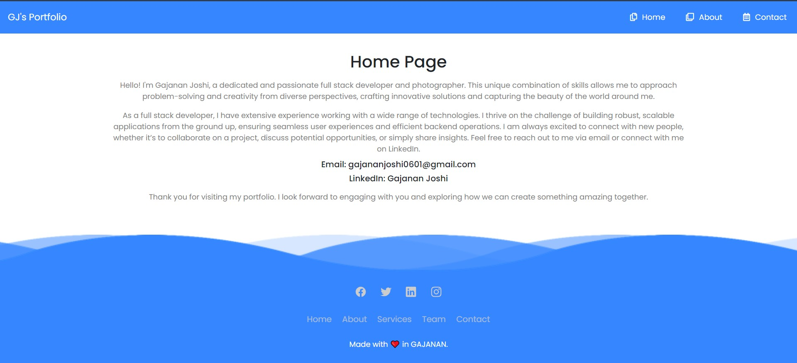
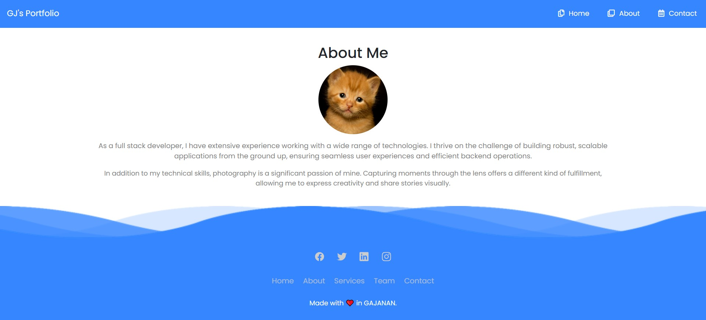
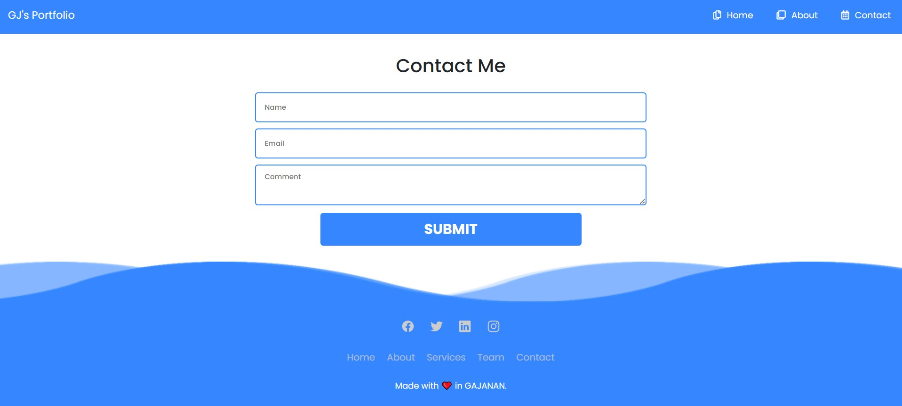

<h1>GJ's Portfolio Web</h1>

Welcome to GJ's Portfolio Web project! This repository contains the code for my personal portfolio website, showcasing my projects, skills, and experiences.

<h2 id="features">Features</h2>
<ul>
    <li>Responsive design for optimal viewing on different devices</li>
    <li>Sections for about me, projects, skills, and contact information</li>
    <li>Interactive and animated elements</li>
    <li>Easy to customize and update</li>
</ul>

<h2 id="installation">Installation</h2>

To get started with Band-Generator, follow these steps:

<ol>
    <li>Clone the repository:</li> 
    <pre><code>git clone https://github.com/yourusername/Band-Generator.git</code></pre>
    <li>Open and Extract It</li>
    <li>Create a Directory or Folder</li>
    <li>Now index.js File creation</li>
    <li>Initialize NPM : </li>
    <pre><code>npm init -y</code></pre>
    <li>Install the Required Packages : </li>
    <pre><code>npm i express ejs body-parser</code></pre>
    <pre><code>npm install express ejs body-parser</code></pre>
    <li>Final Step Install nodemon : </li>
    <pre><code>nodemon index.js</code></pre>
    
</ol>
<h2 id="overview">Quick Overview of the UI</h2>

Here are some screenshots showcasing the main features of our Spotify Clone:

    
     
    <em>Home Page</em>

    
     
    <em>Generated Names</em>

    
     

<h2 id="usage">Usage</h2>

You can customize the content of the portfolio by editing the HTML, CSS, and JavaScript files in the project. Here are the main files to consider:

<ul>
    <li><code>index.html</code> - The main HTML file containing the structure of the portfolio</li>
    <li><code>style.css</code> - The CSS file for styling the portfolio</li>
    <li><code>script.js</code> - The JavaScript file for interactive elements</li>
</ul>

<h2 id="contributing">Contributing</h2>

Contributions are welcome! Please feel free to submit a Pull Request or open an issue for any bugs or feature requests.

<h2 id="license">License</h2>

This project is licensed under the Project Owner : Gajanan Joshi

<h2 id="contact">Contact</h2>

If you have any questions, suggestions, or feedback, feel free to reach out:

<ul>
    <li>Email: <a href="mailto:gajananjoshi0601@gmail.com">gajananjoshi0601@gmail.com</a></li>
    
